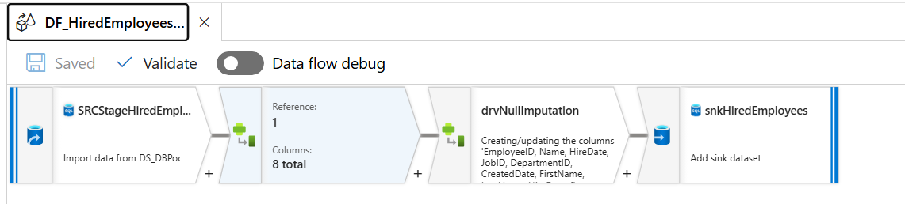
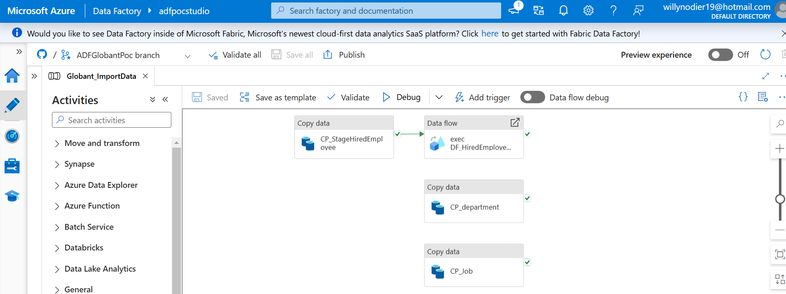

# Globant POC Project

## Introduction

This documentation provides an in-depth overview of the Globant POC Project, designed to solve two main challenges focused on data migration, management, and reporting in Azure. The goal is to demonstrate the effective handling of data operations and analytics through a robust API.

**Challenge #1** involves migrating historical data from CSV files to an SQL database and building a REST API to manage data transactions, validate entries, and support batch processing. Additionally, it includes backup and restore capabilities using AVRO format in Azure Blob Storage to ensure data integrity and recoverability.

**Challenge #2** is based on the loaded data and requires a set of API endpoints to provide specific metrics requested by stakeholders. These include quarterly hiring trends and identifying departments with above-average hiring rates.

This document describes the project files, API endpoints, and the architecture used in Azure to support the solution.

## 1. List of Project Files

Below is a detailed description of each file included in the project:

- **api_datamanagement_gc.py**: Manages data backup and restore functionalities. This script includes operations to handle AVRO file generation and loading from Azure Blob Storage, supporting data integrity and disaster recovery.

- **api_reporting_gc.py**: Handles reporting features for the application, including specific data aggregation endpoints. Provides analytical insights, such as quarterly hiring trends and departments with above-average hiring rates.

- **api_transactional_gc.py**: Defines transactional operations related to employee, department, and job records. Manages the creation, validation, and error handling for these entities, supporting CRUD operations.

- **database_connection.py**: Sets up and manages the database connection parameters. This script includes functionality to establish secure connections using Azure Key Vault secrets and handles connection pooling.

- **function.json**: Configuration file for the Azure Function, specifying the trigger, bindings, and authorization level for the function app.

- **function_app.py**: Main entry point for the FastAPI application, defining the API endpoints, request handling, and response formatting. This script integrates the transactional, data management, and reporting modules, making them accessible via HTTP.

- **requirements.txt**: Lists all Python dependencies for the project, including versions required for Azure SDK, FastAPI, and other libraries. Used to ensure environment consistency.

- **Dockerfile**: Instructions for building the Docker image, setting up dependencies, and configuring environment variables. Enables the application to run in isolated Docker containers.

- **docker-compose.yml**: Facilitates deployment with Docker Compose, managing container creation, network setup, and environment variable configuration. Simplifies multi-container deployment for local testing.

## 2. Endpoints and Functionalities

This section provides an overview of each endpoint, its functionality, and specific test cases for validating the behavior and response of each API route.

### Endpoint `/InsertData`

Allows inserting data into the `HiredEmployees`, `Departments`, and `Jobs` tables based on the specified transaction type.

#### Expected JSON Input Structure:
```json
{
  "transactionType": "TransactionName",
  "transactions": [
    {
      // Specific fields for the transaction type
    }
  ]
}
```
#### Test Cases for `HiredEmployees`

- **Successful Insertion**:
```json
{
  "transactionType": "HiredEmployees",
  "transactions": [
    {
      "FirstName": "Alice",
      "LastName": "Smith",
      "HireDate": "2023-06-01T08:30:00Z",
      "JobID": 3,
      "DepartmentID": 1
    }
  ]
}
```
- **Error: Missing Field (`FirstName`)**:
```json
{
  "transactionType": "HiredEmployees",
  "transactions": [
    {
      "LastName": "Smith",
      "HireDate": "2023-06-01T08:30:00Z",
      "JobID": 3,
      "DepartmentID": 1
    }
  ]
}
```
- **Error: Nonexistent `JobID` or `DepartmentID`**:
```json
{
  "transactionType": "HiredEmployees",
  "transactions": [
    {
      "FirstName": "Bob",
      "LastName": "Brown",
      "HireDate": "2023-06-01T08:30:00Z",
      "JobID": 999,
      "DepartmentID": 888
    }
  ]
}
```
### Endpoint `/BackupData`

Enables creating an AVRO backup of a specific table or all tables.

#### Expected JSON Input Structure:
```json
{
  "tableName": "TableName"
}
```
#### Test Cases

- **Backup of an Existing Table**:
```json
{
  "tableName": "Departments"
}
```
- **Backup of All Tables**:
```json
{
  "tableName": "all"
}
```
- **Error: Nonexistent Table Backup Attempt**:
```json
{
  "tableName": "NonExistentTable"
}
```
### Endpoint `/RestoreData`

Allows restoring a specific table or all tables from an AVRO backup.

#### Expected JSON Input Structure:
```json
{
  "tableName": "TableName"
}
```
#### Test Cases

- **Restore of an Existing Table**:
```json
{
  "tableName": "Jobs"
}
```
- **Restore of All Tables**:
```json
{
  "tableName": "all"
}
```
- **Error: Nonexistent Table Restore Attempt**:
```json
{
  "tableName": "NonExistentTable"
}
```
### Endpoint `/EmployeeHiresByQuarter`

A GET endpoint that retrieves data on employee hires per quarter, organized by department and job.

#### Test Case:

- **Successful Retrieval of Aggregated Data by Quarter**: Run a GET request on `/EmployeeHiresByQuarter` and verify that the output contains the expected aggregated information.

### Endpoint `/DepartmentsAboveAverage`

A GET endpoint that returns a list of departments with above-average hires.

#### Test Case:

- **Successful Retrieval of Above-Average Hire Departments**: Run a GET request on `/DepartmentsAboveAverage` and verify that the output matches the expected data.

## 3. Architecture Overview

The solution is built on Azure components to ensure scalability, security, and ease of management. Key components include:

- **Azure Data Factory (ADF)**: Used for data ingestion, ADF pipelines automate the process of loading historical data from CSV files to the staging tables in Azure SQL Database. The data is then transformed and loaded into production tables, ensuring a clean and structured dataset.



The ADF data flow consists of the following stages:

1. **Import from CSV Files**: Data is read from files in an Azure Blob Storage container.
2. **Null Value Imputation**: Data is cleaned, and null values are imputed.
3. **Load to Database**: The data is stored in the respective SQL table

- **Data Flow Diagram**



- **Azure SQL Database**: Hosts the core application data, including historical and transactional data. This provides a scalable, secure, and managed SQL environment to store and query the data, supporting efficient reporting and analytics.

- **Azure Blob Storage**: Supports data backup and restore operations by storing AVRO files. This ensures that data snapshots are securely stored and can be restored as needed for business continuity.

- **Azure Key Vault**: Manages sensitive information, such as database connection strings and storage keys, ensuring that credentials are securely stored and accessed by the application.

- **GlobantPoc (Azure App Service)**: Serves as the hosting environment for the API, deployed as a web app on Azure. This allows the application to scale easily and integrate seamlessly with other Azure resources, providing a reliable platform for the API endpoints that handle data transactions, backups, and reporting.

- **Docker**: The entire application, including all API endpoints, is containerized with Docker to ensure consistency and portability across environments. Docker enables developers to replicate the production environment locally, ensuring that testing and development align closely with deployment conditions. A `Dockerfile` is provided to build the image, while `docker-compose.yml` facilitates container orchestration for local testing and debugging.

This architecture provides a robust foundation for handling complex data migration and reporting requirements, leveraging Azure's managed services for security, performance, and scalability, while Docker ensures a consistent and portable deployment environment.
